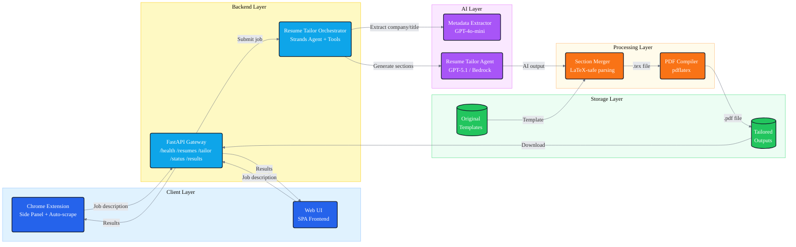
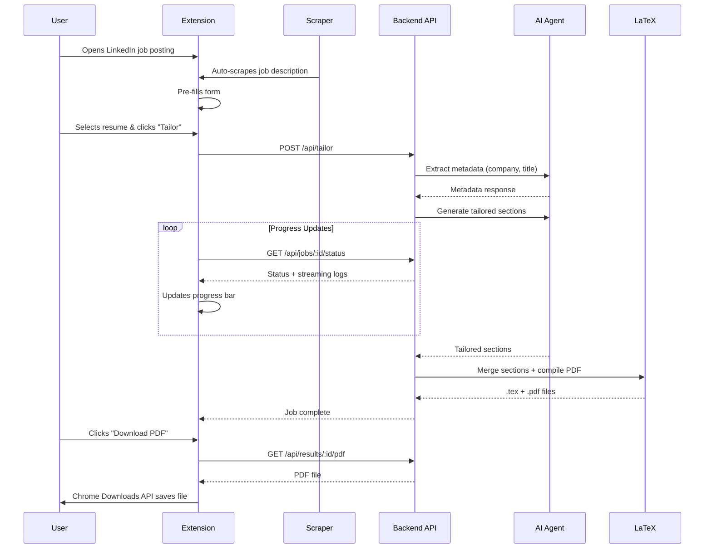

# Resume Tailor - System Architecture

## Problem Evolution

### Phase 1: The Original Pain Point - ChatGPT Manual Workflow

**The Problem:**
Every job application required manually tailoring a LaTeX resume through ChatGPT:

1. Open ChatGPT
2. Paste entire LaTeX resume template
3. Paste job description
4. Ask ChatGPT to tailor specific sections
5. Copy AI-generated text back
6. Manually update LaTeX file
7. Compile PDF locally
8. Repeat for every single job application

**Pain Points:**
- No memory of resume template between sessions
- Had to paste full LaTeX every time
- ChatGPT Atlas tried but wasn't ideal for full automation
- Manual copy-paste of AI output back into LaTeX
- Local LaTeX compilation required
- No consistency in output format
- Time-consuming and error-prone

---

### Phase 2: The SPA Solution - Strands Agent with Preconfigured Template

**The Idea:** Build an AI agent that:
- Has the LaTeX resume template preconfigured
- Understands LaTeX syntax and structure
- Automatically merges AI output into the template
- Compiles PDF automatically
- Provides a reusable, consistent workflow

**Result:** Web-based Single Page Application (SPA)
- Upload resume template once
- Paste job description
- Agent tailors resume sections intelligently
- Automatic PDF compilation
- Download ready-to-use resume

---

### Phase 3: The Bottleneck (Issue #6)

**New Problem Identified:**
The SPA solved the AI/LaTeX automation, but introduced workflow friction:

```
Manual Workflow with SPA:
1. Find job posting on LinkedIn/Indeed
2. Copy job description                    ← Context switch
3. Switch to Resume Tailor browser tab     ← Context switch
4. Paste job description                   ← Manual action
5. Fill in company name and desired title  ← Manual action
6. Click generate
7. Wait for processing
8. Download PDF
9. Switch back to job application          ← Context switch
10. Upload resume to application
```

**~50% efficiency loss** from tab switching and copy-paste actions.

---

### Phase 4: The Chrome Extension - Eliminating Bottlenecks

**Solution:** Bring the Resume Tailor directly to the job posting page

```
Streamlined Workflow with Extension:
1. Browse to job posting on LinkedIn/Indeed
2. Click extension icon (side panel opens)
3. Job description auto-scraped             ← Automated
4. Company/title auto-extracted             ← Automated
5. One-click "Tailor Resume"
6. Download PDF directly from side panel
7. Continue with job application            ← Never left the page
```

**Result:** Zero context switches, zero copy-paste, ~50% time saved.

---

## Problem-Solution Summary

| Phase | Problem | Solution |
|-------|---------|----------|
| **1. ChatGPT** | Manual AI prompting, no template memory, manual LaTeX editing | - |
| **2. SPA** | Solved automation, but tab-switching bottleneck | Strands Agent + preconfigured templates |
| **3. Bottleneck** | Context switching, copy-paste friction | - |
| **4. Extension** | Solved all workflow friction | Auto-scraping, side panel, one-click tailoring |

---

## System Architecture Diagram



---

## Component Details

### 1. Chrome Extension (Solves Bottleneck Issue #6)

**Purpose:** Eliminate tab-switching and manual copy-paste workflow

**Components:**
- **Service Worker** (`service-worker.js`)
  - API endpoint discovery with automatic failover
  - Health check monitoring (localhost → Mac Mini)
  - Cached endpoint management
  - Message handling between popup and backend

- **Popup/Side Panel** (`popup.js`, `popup.html`)
  - Form UI for job posting input
  - Resume selection dropdown
  - Real-time progress tracking
  - Download management using Chrome Downloads API
  - Dynamic link updating

- **Content Scripts**
  - `linkedin-scraper.js` - Extracts job descriptions from LinkedIn
  - `indeed-scraper.js` - Extracts job descriptions from Indeed
  - Runs in MAIN world to access LinkedIn's React-rendered content

**Key Features:**
- Auto-scraping on page load
- SPA navigation detection via URL polling
- Automatic job description pre-fill
- One-click tailoring without tab switching

---

### 2. Backend API (FastAPI)

**Endpoints:**

| Endpoint | Method | Purpose |
|----------|--------|---------|
| `/api/health` | GET | Health check + provider detection |
| `/api/resumes` | GET | List available resume templates |
| `/api/tailor` | POST | Submit tailoring job (async) |
| `/api/jobs/{id}/status` | GET | Poll job progress with streaming logs |
| `/api/results/{id}/tex` | GET | Download tailored .tex file |
| `/api/results/{id}/pdf` | GET | Download compiled PDF |
| `/api/results/{id}/cover-letter` | GET | Download cover letter (txt/pdf/tex) |

**CORS Configuration:**
- Supports `chrome-extension://` origins via regex
- Allows Mac Mini IP (10.10.10.2) for local network deployment
- Multi-origin support for development and production

---

### 3. AI Orchestration (Strands Agents SDK)

**Main Agent:**
- Model: GPT-5.1 (or AWS Bedrock alternative)
- Task: Tailors 3 sections of resume
  1. Professional Summary
  2. Technical Proficiencies
  3. Experience descriptions
- Uses structured prompts from `system_prompt.txt`
- Streams output via log handler

**Metadata Extractor:**
- Model: GPT-4o-mini (lightweight, fast)
- Task: Extract company name and job title from job posting
- Runs before main agent
- User can override extracted values

**Cover Letter Agent:**
- Model: GPT-5.1
- Task: Generate personalized cover letter
- Formats: LaTeX, PDF, plain text
- Based on tailored resume + job posting

**Tools:**
- `resume_helpers.py` - 42KB of helper functions
  - Resume parsing
  - Section extraction
  - LaTeX validation
  - Brace balancing
- `section_updater.py` - LaTeX section replacement logic

---

### 4. LaTeX Processing Pipeline

**Flow:**
```
Original .tex → Parse preamble → Extract sections →
AI generates new sections → Merge sections →
Validate LaTeX syntax → Compile with pdflatex →
Output .tex + .pdf
```

**Safety Features:**
- Preserves preamble (document class, packages, macros)
- Maintains LaTeX formatting
- Brace balancing validation
- Error handling for compilation failures

**Docker LaTeX Distribution:**
- `texlive-latex-base` - Core LaTeX
- `texlive-fonts-recommended` - Standard fonts
- `texlive-latex-extra` - Extra packages
- `texlive-fonts-extra` - FontAwesome icons

---

### 5. Storage Layer

```
data/
├── original/              # User's LaTeX resume templates
│   └── your_resume.tex
├── job_postings/          # Archived job descriptions (JSON)
│   └── {company}_{job_id}.json
├── tailored_resumes/      # Generated resumes (.tex + .pdf)
│   └── {company}_{position}.{tex,pdf}
└── cover_letters/         # Generated cover letters
    └── {company}_{position}_cover_letter.{tex,pdf,txt}
```

---

### 6. Network Architecture

**Local Development:**
```
Windows PC (Chrome Extension) → localhost:8000 → FastAPI Backend
```

**Production (Mac Mini Deployment):**
```
Windows PC (Chrome Extension)
    ↓ HTTP (10.10.10.0/24)
Mac Mini (10.10.10.2:8000) → Docker Container → FastAPI Backend
```

**Automatic Failover:**
1. Service worker tries `http://localhost:8000/api/health`
2. If timeout (2s), tries `http://10.10.10.2:8000/api/health`
3. Caches working endpoint in `chrome.storage.local`
4. All subsequent API calls use cached endpoint

---

## Data Flow Diagram

### Typical User Journey (Chrome Extension)



---

## Key Design Decisions

### 1. Why Chrome Extension?
**Problem:** Manual workflow had ~50% efficiency loss (Issue #6)
- Users had to switch tabs repeatedly
- Copy-paste job descriptions manually
- Navigate away from job posting page

**Solution:**
- Side panel stays open while browsing jobs
- Auto-scraping eliminates manual copy-paste
- Download directly without leaving job page
- URL polling detects SPA navigation on LinkedIn

### 2. Why Async Job Processing?
**Problem:** Resume tailoring takes 30-60 seconds
- AI generation is slow
- PDF compilation takes time
- Browser would timeout on long requests

**Solution:**
- POST `/api/tailor` returns job_id immediately
- Frontend polls `/api/jobs/:id/status` every 2 seconds
- Streaming logs provide real-time feedback
- User sees progress bar + AI output as it generates

### 3. Why Dynamic Endpoint Discovery?
**Problem:** Extension needs to work on both dev machine and remote server
- Hardcoded `localhost` won't work when Mac Mini is backend
- Hardcoded IP won't work during local development

**Solution:**
- Service worker checks multiple endpoints with health checks
- Caches working endpoint for performance
- Automatic failover if cached endpoint becomes unavailable
- Single codebase works in all environments

### 4. Why Chrome Downloads API?
**Problem:** Chrome blocks "insecure downloads" from HTTP sources
- Extension downloads from `http://10.10.10.2:8000`
- Direct `<a href>` downloads show security warnings

**Solution:**
- Use `chrome.downloads.download()` instead of direct links
- Extension's `downloads` permission bypasses warnings
- Provides "Save As" dialog for better UX

### 5. Why LaTeX-Safe Processing?
**Problem:** AI-generated text can break LaTeX compilation
- Unescaped special characters (`&`, `%`, `#`, `_`)
- Unbalanced braces
- Invalid macro usage

**Solution:**
- Preserve original preamble and macros
- Extract only targeted sections for AI rewriting
- Validate brace balancing before compilation
- Fallback error handling for compilation failures

---

## Technology Stack

| Layer | Technology | Purpose |
|-------|-----------|---------|
| **Frontend** | Vanilla JS, HTML5, CSS3 | Chrome Extension + Web UI |
| **Backend** | FastAPI (Python 3.11) | REST API server |
| **AI Framework** | Strands Agents SDK | Agent orchestration |
| **AI Models** | OpenAI GPT-5.1, GPT-4o-mini | Resume tailoring + metadata |
| **Alternative AI** | AWS Bedrock | Failover AI provider |
| **Document Processing** | LaTeX, pdflatex | Resume compilation |
| **Deployment** | Docker, docker-compose | Containerized deployment |
| **Network** | CORS, HTTP | Cross-origin extension support |
| **Browser** | Chrome Extensions API (Manifest V3) | Side panel, downloads, scripting |

---

## Performance Optimizations

1. **Endpoint Caching:** Service worker caches working API endpoint in `chrome.storage`
2. **Lazy PDF Compilation:** Only compiles PDF if user requests it (optional checkbox)
3. **Lightweight Metadata Extraction:** Uses GPT-4o-mini instead of GPT-5.1 for speed
4. **Streaming Logs:** Real-time progress updates prevent perceived lag
5. **Docker Health Checks:** Ensures container is ready before accepting requests
6. **Parallel Content Scripts:** LinkedIn and Indeed scrapers load independently

---

## Security Considerations

1. **CORS Protection:** Only allows specific origins (localhost, Mac Mini IP, chrome-extension://)
2. **API Keys:** Stored in `.env` file, excluded from git via `.gitignore`
3. **Host Permissions:** Extension explicitly declares needed hosts in manifest
4. **No Credentials in Code:** All sensitive data via environment variables
5. **Local Network Only:** Mac Mini deployment not exposed to internet
6. **File Path Validation:** Backend validates resume file paths before reading

---

## Deployment Architecture

### Docker Container (Multi-platform)
```yaml
Platform: linux/arm64 (Mac Mini Apple Silicon)
Base Image: python:3.11-slim
Exposed Port: 8000
Volumes:
  - ./data → /app/data (resume storage)
  - ./.env → /app/.env (API credentials)
  - ./logs → /app/logs (application logs)
Restart Policy: unless-stopped
Health Check: GET /api/health every 30s
```

### Network Configuration
```
Windows PC:        Any IP on 10.10.10.0/24
Mac Mini Server:   10.10.10.2 (static IP)
Port:              8000 (HTTP, not HTTPS)
Firewall:          Docker allowed through macOS firewall
```

---

## Future Enhancements (Open Issues)

1. **Smooth Progress Bar** (Issue #2)
   - Replace step-based indicator with smooth animation
   - Better mobile view support

2. **Cover Letter Questions** (Issue #3)
   - Add prompts: "Why do you want to work here?"
   - Add prompts: "Why would you be a good fit?"

3. **HTTPS Support**
   - Self-signed certificates for local network
   - Eliminate "insecure download" warnings completely

4. **Multi-Resume Support**
   - Manage multiple resume variants
   - Quick-switch between different base resumes

---

## Metrics & Analytics

**Efficiency Gains (vs Manual Workflow):**
- **Tab Switches:** 4+ → 0
- **Copy-Paste Actions:** 2+ → 0
- **Form Fields:** 3 → 1 (resume selection only)
- **Clicks:** 5+ → 2 (extension icon + tailor button)
- **Estimated Time Saved:** ~50% per job application

**System Performance:**
- Health Check Response: <100ms
- Metadata Extraction: ~3-5 seconds
- Resume Tailoring: ~30-45 seconds (AI-dependent)
- PDF Compilation: ~2-3 seconds
- Total Job Time: ~35-50 seconds

---

## Contact & Resources

- **Strands Agents SDK:** [https://strandsagents.com](https://strandsagents.com)
- **GitHub Issues:** Track bottlenecks and feature requests
- **Docker Hub:** Multi-platform container images

---

*Architecture designed to solve Issue #6 (Bottleneck): Reducing resume tailoring workflow from multi-tab manual process to one-click automated solution.*
