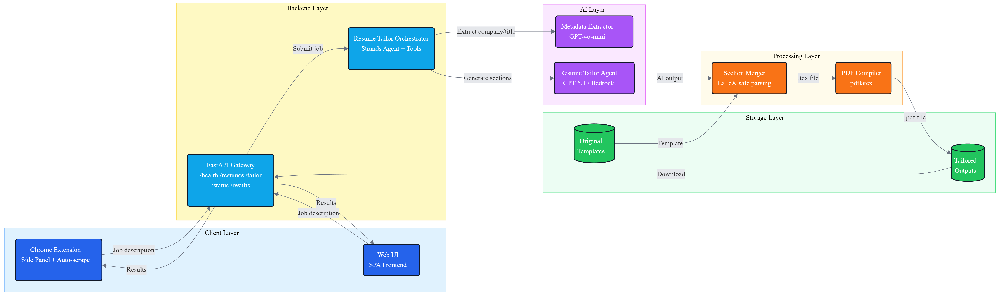

# Resume Tailor Agent

AI-powered resume and cover letter customization using [Strands Agents SDK](https://strandsagents.com). This application intelligently tailors your LaTeX resume and generates matching cover letters for specific job postings using advanced language models.

## The Problem This Solves

### Evolution from Manual ChatGPT to Automated Extension

**Phase 1: Manual ChatGPT Workflow** (╥﹏╥)
- Open ChatGPT for every job application
- Paste entire LaTeX resume template every time
- Manually copy AI-generated sections back into LaTeX
- Compile PDF locally
- No template memory between sessions
- ChatGPT Atlas wasn't ideal for full automation

**Phase 2: SPA with Strands Agent** (˶ᵔ ᵕ ᵔ˶)
- Built a web app with preconfigured LaTeX template
- AI agent understands resume structure
- Automatic section merging and PDF compilation
- Reusable workflow with template memory

**Phase 3: Bottleneck Identified (Issue #6)** ( ꩜ ᯅ ꩜;)
- Tab switching between job boards and Resume Tailor
- Manual copy-paste of job descriptions
- ~50% efficiency loss from context switching

**Phase 4: Chrome Extension Solution** ♡〜٩(˃▿˂)۶〜♡
- Auto-scrapes job descriptions from LinkedIn/Indeed
- Side panel stays open while browsing jobs
- Zero context switches, zero copy-paste
- Download directly without leaving job page
- **Result: ~50-85% time saved per application**

ദ്ദി ˉ͈̀꒳ˉ͈́ )✧ **Full architecture details:** See [ARCHITECTURE.md](ARCHITECTURE.md)

---

## Features

- **Smart Resume Tailoring** – AI rewrites your Professional Summary, Technical Proficiencies, and Experience sections to match job requirements
- **Cover Letter Generation** – Automatically generates professional cover letters in LaTeX, PDF, and plain text formats
- **Chrome Extension** – Tailor resumes directly from job posting pages without switching tabs (addresses [Issue #6](https://github.com/your-repo/issues/6))
- **Auto-Scraping** – Automatically extracts job descriptions from LinkedIn and Indeed job pages
- **Metadata Extraction** – Lightweight AI extracts company name and job title from job postings
- **Real-time Progress** – Watch your documents being generated with smooth progress bars and streaming AI output
- **Multi-format Output** – Get LaTeX source files (.tex), compiled PDFs, and plain text versions
- **Modern Web UI** – Clean interface with live progress tracking, file management, and download history
- **Docker Support** – One-command deployment with all dependencies (including LaTeX) bundled
- **Streaming Output** – See AI-generated text appear in real-time as it's being created
- **LaTeX-safe Processing** – Preserves your resume's preamble, macros, and formatting

---

## Quick Start

### Option 1: Chrome Extension (Fastest for Job Applications)

Streamline your workflow by tailoring resumes directly from job posting pages:

```bash
# 1. Start the backend (Docker or local)
docker-compose up -d
# OR
python -m uvicorn backend.main:app --reload

# 2. Load extension in Chrome
# - Open chrome://extensions/
# - Enable "Developer mode" (top-right toggle)
# - Click "Load unpacked"
# - Select folder: d:\Strands-agent\extension

# 3. Use the extension
# - Navigate to a LinkedIn or Indeed job posting
# - Click the Resume Tailor extension icon
# - Job description auto-fills automatically
# - Select resume → Click "Tailor Resume"
# - Download results directly from the side panel
```

**📖 Full extension documentation:** See [extension/README.md](extension/README.md) and [extension/HOW_TO_LOAD.md](extension/HOW_TO_LOAD.md)

### Option 2: Docker (Recommended for Web UI)

The easiest way to get started - includes Python, LaTeX, and all dependencies.

```bash
# 1. Clone the repository
git clone <your-repo-url>
cd Strands-agent

# 2. Create .env file with your OpenAI API key
echo "OPENAI_API_KEY=sk-your-key-here" > .env

# 3. Place your resume in data/original/
mkdir -p data/original
cp your_resume.tex data/original/

# 4. Start the application
docker-compose up -d

# 5. Open your browser
# http://localhost:8000
```

**Docker Commands:**
```bash
# View logs
docker logs resume-tailor -f

# Stop the service
docker-compose down

# Rebuild after code changes
docker-compose up --build -d

# Test LaTeX installation in container
docker exec resume-tailor pdflatex --version
```

**What's Included in Docker:**
- Python 3.11 runtime
- All Python dependencies from `requirements.txt`
- Complete LaTeX distribution:
  - `texlive-latex-base` - Core LaTeX
  - `texlive-fonts-recommended` - Standard fonts
  - `texlive-latex-extra` - Extra packages
  - `texlive-fonts-extra` - **FontAwesome icons** and additional fonts
- Uvicorn web server
- Health check endpoint monitoring

### Option 3: Local Installation

```bash
# 1. Install Python dependencies
python -m venv .venv
.venv\Scripts\activate        # Windows
source .venv/bin/activate     # macOS/Linux
pip install -r requirements.txt

# 2. (Optional) Install LaTeX for PDF compilation
# Windows: Install MiKTeX from https://miktex.org/download
# macOS: brew install --cask basictex
# Linux: sudo apt-get install texlive-latex-base texlive-fonts-recommended

# 3. Create .env file
echo "OPENAI_API_KEY=sk-your-key-here" > .env

# 4. Run the web server
python -m uvicorn backend.main:app --reload

# 5. Open your browser
# http://localhost:8000
```

---

## Chrome Extension Usage

**Quick Start:**
1. Load extension in Chrome (see [extension/HOW_TO_LOAD.md](extension/HOW_TO_LOAD.md))
2. Browse to LinkedIn/Indeed job posting
3. Click extension icon → Job auto-scrapes
4. Select resume → Click "Tailor Resume"
5. Download PDF directly from side panel

**Key Features:**
- Auto-scrapes job descriptions, company names, and titles
- Side panel stays open while browsing multiple jobs
- Detects job navigation and auto-scrapes new postings (1s delay)
- Direct downloads without leaving the job page
- Supports LinkedIn (`*.linkedin.com/jobs/*`) and Indeed (`*.indeed.com/viewjob*`)

**Time Saved:** ~60-85% per application (zero tab switching, zero copy-paste)

---

## Requirements

- **Python 3.10+**
- **OpenAI API key** (place in `.env` file) or AWS Bedrock credentials
- **LaTeX distribution** (only for local PDF compilation - Docker includes this):
  - Windows: [MiKTeX](https://miktex.org/download)
  - macOS: BasicTeX (`brew install --cask basictex`)
  - Linux: `sudo apt-get install texlive-latex-base texlive-fonts-recommended texlive-latex-extra texlive-fonts-extra`
  - **Docker**: Includes complete LaTeX setup with FontAwesome and additional fonts automatically

---

## Web Interface

The web UI provides a complete workflow for resume tailoring and cover letter generation:

### Resume Tailoring Section
1. **Select Resume** – Choose from uploaded resumes or upload a new .tex file
2. **Paste Job Posting** – Copy/paste the job description (minimum 50 characters)
3. **Optional Overrides** – Customize company name or desired title
4. **Customization Options**:
   - Include Professional Experience section
   - Render PDF (requires LaTeX installation or Docker)
5. **Real-time Progress** – Watch the progress bar (0% → 100%) with streaming AI output
6. **Download Results** – Get both .tex and .pdf files
7. **History** – View and manage all previously tailored resumes

### Cover Letter Section
1. **Reuse Job Posting** – Automatically uses the same job posting from resume section
2. **Optional Tailored Resume** – Select a tailored resume for more personalized cover letters
3. **Generate** – AI creates a professional cover letter matching your resume
4. **Download Options**:
   - LaTeX source (.tex)
   - Compiled PDF (.pdf)
   - Plain text (.txt) for copy/pasting
5. **Copy to Clipboard** – One-click copy of cover letter text

### Live Features
- **Streaming AI Output** – See text being generated in real-time
- **Smooth Progress Animation** – Percentage-based progress with fluid animations
- **Auto-scroll Logs** – Terminal output automatically scrolls to show latest content
- **Responsive Design** – Works on desktop, tablet, and mobile devices

---

## Architecture



**5-Layer Architecture:**
- **Client**: Chrome Extension (auto-scrape) + Web UI
- **Backend**: FastAPI + Strands Agent orchestrator
- **AI**: GPT-4o-mini (metadata) + GPT-5.1 (tailoring)
- **Processing**: LaTeX merger + PDF compiler
- **Storage**: Templates → Outputs

ദ്ദി(˵ •̀ ᴗ - ˵ ) ✧ **Full details:** [ARCHITECTURE.md](ARCHITECTURE.md)

---

## How It Works

**Resume Tailoring:**
1. **Metadata Extraction** (GPT-4o-mini) → Company/title from job posting
2. **Section Extraction** → Parse LaTeX resume, preserve preamble
3. **AI Generation** (GPT-5.1) → Rewrite sections to match job requirements
4. **Section Merging** → Validate LaTeX syntax, merge new content
5. **PDF Compilation** → `pdflatex` generates final PDF

**Cover Letter:**
1. Read resume context + job metadata
2. AI generates cover letter (GPT-5.1)
3. Output: LaTeX (.tex), Plain text (.txt), PDF (.pdf)

---

## Project Structure

```
Strands-agent/
├── backend/                         # FastAPI backend
│   ├── main.py                      # App entry point
│   ├── config.py                    # Configuration (models, paths, timeouts)
│   ├── api/
│   │   ├── models.py                # Request/response schemas
│   │   └── routes.py                # API endpoints
│   └── services/
│       ├── resume_service.py        # Resume tailoring jobs
│       ├── cover_letter_service.py  # Cover letter jobs
│       └── log_handler.py           # Real-time log streaming
│
├── extension/                       # Chrome MV3 Extension
│   ├── manifest.json                # Extension configuration
│   ├── popup/
│   │   ├── popup.html               # Side panel UI
│   │   ├── popup.css                # Brutalist theme styling
│   │   └── popup.js                 # Logic, polling, downloads
│   ├── background/
│   │   └── service-worker.js        # API communication
│   ├── content/
│   │   ├── linkedin-scraper.js      # LinkedIn job extraction
│   │   └── indeed-scraper.js        # Indeed job extraction
│   ├── icons/                       # Extension icons (16px, 48px, 128px)
│   ├── README.md                    # Full extension documentation
│   ├── INSTALL.md                   # Installation guide
│   └── HOW_TO_LOAD.md               # Visual step-by-step guide
│
├── frontend/                        # Web UI (vanilla JS + Tailwind CSS)
│   ├── index.html                   # Main page
│   ├── app.js                       # Application logic
│   └── styles.css                   # Custom styling
│
├── tools/                           # Core utilities
│   ├── resume_helpers.py            # Main workflow orchestration
│   └── section_updater.py           # LaTeX parsing and merging
│
├── prompts/                         # AI system prompts
│   ├── system_prompt.txt            # Resume tailoring instructions
│   └── cover_letter_system_prompt.txt
│
├── data/
│   ├── original/                    # Your source resumes (.tex)
│   ├── tailored_resumes/            # Generated tailored resumes
│   ├── cover_letters/               # Generated cover letters
│   └── job_postings/                # Job posting files (optional)
│
├── logs/                            # Application logs
├── Dockerfile                       # Docker image definition
├── docker-compose.yml               # Docker Compose config
├── requirements.txt                 # Python dependencies
├── resume_tailor.ipynb              # Jupyter notebook interface (advanced)
├── EXTENSION_QUICKSTART.md          # Extension quick start guide
└── README.md
```

---

## API Endpoints

### Resume Tailoring
- `POST /api/tailor` – Create tailoring job
- `GET /api/jobs/{job_id}/status` – Check status with streaming logs
- `GET /api/resumes` – List available resumes
- `POST /api/resumes/upload` – Upload new resume
- `GET /api/results` – List tailored resumes
- `GET /api/results/{id}/tex` – Download LaTeX file
- `GET /api/results/{id}/pdf` – Download PDF
- `DELETE /api/results/{id}` – Delete result

### Cover Letters
- `POST /api/cover-letter` – Create cover letter job
- `GET /api/cover-letter/jobs/{job_id}/status` – Check status
- `GET /api/cover-letter/results` – List cover letters
- `GET /api/cover-letter/results/{id}/tex` – Download LaTeX
- `GET /api/cover-letter/results/{id}/pdf` – Download PDF
- `GET /api/cover-letter/results/{id}/text` – Download plain text
- `DELETE /api/cover-letter/results/{id}` – Delete cover letter

### Documentation
- **Swagger UI**: http://localhost:8000/docs (interactive testing)
- **ReDoc**: http://localhost:8000/redoc (clean documentation)
- **Health Check**: http://localhost:8000/api/health

---

## Configuration

### Environment Variables (.env)

```bash
# OpenAI (recommended)
OPENAI_API_KEY=sk-your-openai-key

# Or AWS Bedrock (alternative)
AWS_BEARER_TOKEN_BEDROCK=your-bedrock-token
AWS_REGION=us-east-1
# Or use standard AWS credentials:
# AWS_ACCESS_KEY_ID=your-access-key
# AWS_SECRET_ACCESS_KEY=your-secret-key
```

### AI Models (backend/config.py)

```python
DEFAULT_MAIN_MODEL = "gpt-5.1"          # Resume & cover letter generation
DEFAULT_METADATA_MODEL = "gpt-4o-mini"  # Company/position extraction
AGENT_CALL_TIMEOUT = 120                # Max seconds per AI call
JOB_TIMEOUT = 300                       # Max seconds per job
```

### Output Directories

All outputs are saved to the `data/` directory:
- `data/tailored_resumes/` – Tailored resume files
- `data/cover_letters/` – Cover letter files
- `logs/` – Application logs

Filenames follow the pattern: `Company_Position.tex` (e.g., `Google_Senior_ML_Engineer.tex`)

---

## Advanced: Jupyter Notebook

For developers who prefer interactive notebooks:

```bash
# 1. Install Jupyter
pip install jupyter

# 2. Launch notebook
jupyter notebook resume_tailor.ipynb

# 3. Run cells to:
#    - Initialize agents
#    - Load job posting from data/job_postings/posting_details.txt
#    - Generate tailored resume
#    - View results inline
```

The notebook provides direct access to the `tailor_resume_sections()` function for customization.

---

## Troubleshooting

### Chrome Extension Issues

**Extension won't load in Chrome**:
- Ensure all files exist in `extension/` folder
- Check `manifest.json` is valid JSON (no syntax errors)
- Chrome version must be 88+ for Manifest V3 support
- See detailed instructions in [extension/HOW_TO_LOAD.md](extension/HOW_TO_LOAD.md)

**Cannot connect to backend**:
- Backend must be running on `http://localhost:8000`
- Verify by visiting http://localhost:8000 in browser
- Check CORS is configured: `backend/config.py` should include `"chrome-extension://*"` in `ALLOWED_ORIGINS`
- Restart backend after CORS changes

**Auto-scraping doesn't work on LinkedIn/Indeed**:
- **After updating extension**: Reload extension (chrome://extensions/ → reload icon) AND refresh the LinkedIn page
- Content scripts only inject after page loads
- Check browser console (F12) for errors like "Could not establish connection. Receiving end does not exist."
- This error means content script isn't loaded - reload extension and refresh page
- Try clicking the "Re-scrape Job Posting" button manually
- Fallback: Manually paste job description into textarea

**Company/Title fields don't auto-fill**:
- LinkedIn frequently changes their HTML class names (obfuscated classes)
- Extension uses robust fallback selectors (`h1` for title, `a[href*="/company/"]` for company)
- If scraped but not filled, check browser console for scraper response
- You can manually type company/title - backend accepts both scraped and manual values
- Empty fields → AI auto-extracts from job description (fallback behavior)

**Extension doesn't detect new jobs when navigating**:
- Extension monitors URL changes for `currentJobId` parameter with 1-second delay
- Works best when clicking jobs in LinkedIn's job list sidebar
- Debounce prevents rapid navigation from triggering multiple scrapes
- Manual button available as backup: "Re-scrape Job Posting"
- Check console (F12) for "Auto-scraping job: <id>" messages after 1-second delay

**Downloads not working**:
- Check job completed successfully (100% progress)
- Verify files exist in `data/tailored_resumes/` directory
- Chrome download permissions must be enabled
- Alternative: Click "View Full Results & History" link to download from web app

**Side panel stays blank**:
- Right-click extension icon → "Inspect" to open DevTools
- Check Console tab for JavaScript errors
- Verify backend API is responding: http://localhost:8000/api/health
- Try reloading extension: chrome://extensions/ → Find "Resume Tailor" → Click reload icon

### `pdflatex not found` (Local installations only)

**Docker users**: This error won't occur - LaTeX is included.

**Local users**: Install a LaTeX distribution:

**Windows (MiKTeX)**:
1. Download from https://miktex.org/download
2. Install and add to PATH: `C:\Users\<you>\AppData\Local\Programs\MiKTeX\miktex\bin\x64`
3. Restart terminal

**macOS (BasicTeX)**:
```bash
brew install --cask basictex
export PATH="/Library/TeX/texbin:$PATH"

# Install required packages
sudo tlmgr update --self
sudo tlmgr install collection-latexrecommended collection-fontsrecommended \
  fira fontawesome preprint tools fontaxes anyfontsize
```

**Linux**:
```bash
sudo apt-get install texlive-latex-base texlive-fonts-recommended \
  texlive-latex-extra texlive-fonts-extra
```

**Alternative**: Set `render_pdf=False` in the UI and upload .tex files to [Overleaf](https://overleaf.com) for compilation.

### Missing LaTeX Packages

If PDF compilation fails with missing package errors:

```bash
# BasicTeX/MacTeX (macOS)
sudo tlmgr install <package-name>

# MiKTeX (Windows) - auto-installs on first use, or:
mpm --install=<package-name>

# TeX Live (Linux)
sudo apt-get install texlive-<package-category>
```

Common packages needed: `fullpage`, `enumitem`, `tabularx`, `fontawesome`, `fira`, `fontaxes`, `anyfontsize`

### Docker Issues

**Container won't start**:
```bash
# Check logs
docker logs resume-tailor

# Rebuild image
docker-compose down
docker-compose up --build
```

**Can't find generated files**:
- Check `./data/tailored_resumes/` (Docker mounts this directory)
- Ensure `.env` file exists and is mounted

**Port 8000 already in use**:
```bash
# Edit docker-compose.yml, change port mapping:
ports:
  - "8001:8000"  # Use port 8001 instead
```

### API/Model Issues

**`No API key configured`**:
- Ensure `.env` file exists in project root
- Check `OPENAI_API_KEY` is set correctly
- Restart the server/container

**Timeout errors**:
- Increase `AGENT_CALL_TIMEOUT` in `backend/config.py`
- Long job postings may require more time

**Token/cost concerns**:
- Uncheck "Include Professional Experience" to reduce token usage
- Use `gpt-4o-mini` for main model (edit `DEFAULT_MAIN_MODEL` in config)

---

## Development

### Running Frontend Separately

```bash
# Terminal 1: Backend API only
python -m uvicorn backend.main:app --reload --port 8000

# Terminal 2: Frontend static server
cd frontend
python -m http.server 3000

# Update CORS in backend/config.py:
ALLOWED_ORIGINS = ["http://localhost:3000"]
```

### Making Changes

**Frontend** (no build step required):
1. Edit `frontend/app.js`, `frontend/styles.css`, or `frontend/index.html`
2. Refresh browser - changes are immediate

**Backend**:
1. Edit files in `backend/`, `tools/`, or `prompts/`
2. Server auto-reloads with `--reload` flag
3. For Docker: `docker-compose restart`

**Testing**:
- Use Swagger UI at http://localhost:8000/docs to test API endpoints
- Check `logs/` directory for detailed application logs

---

## Contributing

Contributions are welcome! Areas for improvement:
- Additional output formats (Word, Markdown)
- More AI model providers (Anthropic Claude, Google Gemini)
- Enhanced UI features (dark mode, templates)
- Automated testing suite

---

## License

This project is released under the **Creative Commons Attribution-NonCommercial 4.0 International (CC BY-NC 4.0)** license.

You may:
- Use for personal job applications
- Modify and adapt the code
- Share with attribution

You may not:
- Use for commercial purposes without permission
- Sell or monetize the service

Your resume content remains yours - keep `.env`, resumes, and job postings out of version control.

---

## Resources

- **Strands Agents SDK**: https://strandsagents.com
- **OpenAI Platform**: https://platform.openai.com
- **AWS Bedrock**: https://aws.amazon.com/bedrock
- **LaTeX Project**: https://www.latex-project.org
- **MiKTeX**: https://miktex.org
- **Overleaf**: https://overleaf.com (online LaTeX editor)

---

## Tips for Best Results

1. **Resume Format**: Use the provided LaTeX template structure with clearly marked sections (`\section{Professional Summary}`, etc.)
2. **Job Postings**: Include full job descriptions with requirements and responsibilities
3. **Company Override**: Use the company name field if AI extracts incorrectly
4. **Experience Section**: Only include when needed - saves tokens and processing time
5. **Cover Letters**: Use tailored resumes for more personalized cover letters
6. **Review Output**: Always review AI-generated content before submitting applications

---

**Built with [Strands Agents SDK](https://strandsagents.com)**
