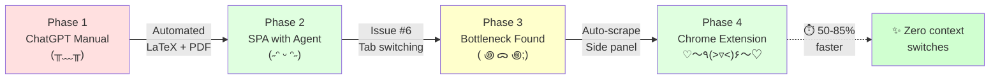

# Resume Tailor Agent

AI-powered resume and cover letter customization using [Strands Agents SDK](https://strandsagents.com). This application intelligently tailors your LaTeX resume and generates matching cover letters for specific job postings using advanced language models.

## The Problem This Solves

### Evolution from Manual ChatGPT to Automated Extension



**Before vs After:**

```
BEFORE (Manual ChatGPT):                    AFTER (Chrome Extension):
┌────────────────────────────────┐         ┌────────────────────────────────┐
│ 1. Open ChatGPT        ⏱️ 1min │         │ 1. Click extension     ⏱️ 5sec │
│ 2. Paste resume        ⏱️ 1min │         │ 2. Auto-scrapes job    ⏱️ 1sec │
│ 3. Paste job desc      ⏱️ 1min │         │ 3. Click "Tailor"      ⏱️ 1min │
│ 4. Copy AI output      ⏱️ 2min │         │ 4. Download PDF        ⏱️ 5sec │
│ 5. Update LaTeX        ⏱️ 3min │         └────────────────────────────────┘
│ 6. Compile PDF         ⏱️ 1min │         Total: ~1.5 minutes
└────────────────────────────────┘
Total: ~9 minutes
```

**Efficiency Gains:**

| Phase | What Changed | Time per Application |
|-------|--------------|---------------------|
| 1️⃣ ChatGPT | Manual prompting every time | 😓 ~9 min |
| 2️⃣ SPA | Automated LaTeX + PDF | 😊 ~4 min |
| 3️⃣ Bottleneck | Identified tab-switching issue | - |
| 4️⃣ Extension | Auto-scrape + side panel | 🎉 ~1.5 min |

<details>
<summary>📖 View detailed phase breakdown</summary>

**Phase 1: Manual ChatGPT Workflow** (╥﹏╥)
- Open ChatGPT for every job application
- Paste entire LaTeX resume template every time
- Manually copy AI-generated sections back into LaTeX
- Compile PDF locally
- No template memory between sessions
- ChatGPT Atlas wasn't ideal for full automation

**Phase 2: SPA with Strands Agent** (˶ᵔ ᵕ ᵔ˶)
- Built a web app with preconfigured LaTeX template
- AI agent understands resume structure
- Automatic section merging and PDF compilation
- Reusable workflow with template memory

**Phase 3: Bottleneck Identified (Issue #6)** ( ꩜ ᯅ ꩜;)
- Tab switching between job boards and Resume Tailor
- Manual copy-paste of job descriptions
- ~50% efficiency loss from context switching

**Phase 4: Chrome Extension Solution** ♡〜٩(˃▿˂)۶〜♡
- Auto-scrapes job descriptions from LinkedIn/Indeed
- Side panel stays open while browsing jobs
- Zero context switches, zero copy-paste
- Download directly without leaving job page
- **Result: ~50-85% time saved per application**

</details>

ദ്ദി ˉ͈̀꒳ˉ͈́ )✧ **Full architecture details:** See [ARCHITECTURE.md](ARCHITECTURE.md)

---

## Features

- **Smart Resume Tailoring** – AI rewrites your Professional Summary, Technical Proficiencies, and Experience sections to match job requirements
- **Cover Letter Generation** – Automatically generates professional cover letters in LaTeX, PDF, and plain text formats
- **Chrome Extension** – Tailor resumes directly from job posting pages without switching tabs (addresses [Issue #6](https://github.com/your-repo/issues/6))
- **Auto-Scraping** – Automatically extracts job descriptions from LinkedIn and Indeed job pages
- **Metadata Extraction** – Lightweight AI extracts company name and job title from job postings
- **Real-time Progress** – Watch your documents being generated with smooth progress bars and streaming AI output
- **Multi-format Output** – Get LaTeX source files (.tex), compiled PDFs, and plain text versions
- **Modern Web UI** – Clean interface with live progress tracking, file management, and download history
- **Docker Support** – One-command deployment with all dependencies (including LaTeX) bundled
- **Streaming Output** – See AI-generated text appear in real-time as it's being created
- **LaTeX-safe Processing** – Preserves your resume's preamble, macros, and formatting

---

## Quick Start

```bash
# 1. Clone and setup
git clone <your-repo-url>
cd Strands-agent
echo "OPENAI_API_KEY=sk-your-key-here" > .env

# 2. Add your LaTeX resume
mkdir -p data/original
cp your_resume.tex data/original/

# 3. Start with Docker
docker-compose up -d

# 4. Open http://localhost:8000
```

**Chrome Extension:** Load `extension/` folder as unpacked extension ([guide](extension/HOW_TO_LOAD.md))

---

## Requirements

- **Docker** (recommended) or **Python 3.10+**
- **OpenAI API key** or AWS Bedrock credentials
- **LaTeX resume template** (.tex file) - Compatible with [Leslie Cheng's template](https://github.com/lcfyi/software-resume-template)

### LaTeX Template Requirements

This application works best with structured LaTeX resumes that use:
- Clearly marked `\section{}` commands for sections
- Specific section names: `Professional Summary`, `Technical Proficiencies`, `Professional Experience`
- Custom macros and preambles (automatically preserved)
- FontAwesome icons and Fira Sans font (included in Docker)

**Recommended template:** [Software Engineering Resume by Leslie Cheng](https://github.com/lcfyi/software-resume-template) ([Overleaf](https://www.overleaf.com/latex/templates/software-engineering-resume/mcvwcrmddsyw))

ദ്ദി(˵ •̀ ᴗ - ˵ ) ✧ **Sample template:** See [data/original/sample_resume.tex](data/original/sample_resume.tex)

---

## Usage

**Web UI:** Select resume → Paste job posting → Download tailored .tex/.pdf
**Chrome Extension:** Browse job → Click icon → Auto-scrapes → Download
**API Docs:** http://localhost:8000/docs

---

## Architecture


**5-Layer Architecture:**
- **Client**: Chrome Extension (auto-scrape) + Web UI
- **Backend**: FastAPI + Strands Agent orchestrator
- **AI**: GPT-4o-mini (metadata) + GPT-5.1 (tailoring)
- **Processing**: LaTeX merger + PDF compiler
- **Storage**: Templates → Outputs

ദ്ദി(˵ •̀ ᴗ - ˵ ) ✧ **Full details:** [ARCHITECTURE.md](ARCHITECTURE.md)

---

## How It Works

**Resume Tailoring:**
1. **Metadata Extraction** (GPT-4o-mini) → Company/title from job posting
2. **Section Extraction** → Parse LaTeX resume, preserve preamble
3. **AI Generation** (GPT-5.1) → Rewrite sections to match job requirements
4. **Section Merging** → Validate LaTeX syntax, merge new content
5. **PDF Compilation** → `pdflatex` generates final PDF

**Cover Letter:**
1. Read resume context + job metadata
2. AI generates cover letter (GPT-5.1)
3. Output: LaTeX (.tex), Plain text (.txt), PDF (.pdf)

---

## Project Structure

```
Strands-agent/
├── backend/                         # FastAPI backend
│   ├── main.py                      # App entry point
│   ├── config.py                    # Configuration (models, paths, timeouts)
│   ├── api/
│   │   ├── models.py                # Request/response schemas
│   │   └── routes.py                # API endpoints
│   └── services/
│       ├── resume_service.py        # Resume tailoring jobs
│       ├── cover_letter_service.py  # Cover letter jobs
│       └── log_handler.py           # Real-time log streaming
│
├── extension/                       # Chrome MV3 Extension
│   ├── manifest.json                # Extension configuration
│   ├── popup/
│   │   ├── popup.html               # Side panel UI
│   │   ├── popup.css                # Brutalist theme styling
│   │   └── popup.js                 # Logic, polling, downloads
│   ├── background/
│   │   └── service-worker.js        # API communication
│   ├── content/
│   │   ├── linkedin-scraper.js      # LinkedIn job extraction
│   │   └── indeed-scraper.js        # Indeed job extraction
│   ├── icons/                       # Extension icons (16px, 48px, 128px)
│   ├── README.md                    # Full extension documentation
│   ├── INSTALL.md                   # Installation guide
│   └── HOW_TO_LOAD.md               # Visual step-by-step guide
│
├── frontend/                        # Web UI (vanilla JS + Tailwind CSS)
│   ├── index.html                   # Main page
│   ├── app.js                       # Application logic
│   └── styles.css                   # Custom styling
│
├── tools/                           # Core utilities
│   ├── resume_helpers.py            # Main workflow orchestration
│   └── section_updater.py           # LaTeX parsing and merging
│
├── prompts/                         # AI system prompts
│   ├── system_prompt.txt            # Resume tailoring instructions
│   └── cover_letter_system_prompt.txt
│
├── data/
│   ├── original/                    # Your source resumes (.tex)
│   ├── tailored_resumes/            # Generated tailored resumes
│   ├── cover_letters/               # Generated cover letters
│   └── job_postings/                # Job posting files (optional)
│
├── logs/                            # Application logs
├── Dockerfile                       # Docker image definition
├── docker-compose.yml               # Docker Compose config
├── requirements.txt                 # Python dependencies
├── resume_tailor.ipynb              # Jupyter notebook interface (advanced)
├── EXTENSION_QUICKSTART.md          # Extension quick start guide
└── README.md
```

---

## Configuration

Create `.env` file:
```bash
OPENAI_API_KEY=sk-your-key  # or use AWS_BEARER_TOKEN_BEDROCK
```

Customize AI models in `backend/config.py` (defaults: GPT-5.1 for tailoring, GPT-4o-mini for metadata)

---

## Troubleshooting

**Container won't start:** `docker logs resume-tailor`
**Extension issues:** See [extension/HOW_TO_LOAD.md](extension/HOW_TO_LOAD.md)
**API errors:** Check `.env` has `OPENAI_API_KEY`
**General help:** Open issue on GitHub or check API docs at http://localhost:8000/docs

---

## License

**CC BY-NC 4.0** - Free for personal use, see LICENSE for details.

---

**Built with [Strands Agents SDK](https://strandsagents.com)** | ദ്ദി(˵ •̀ ᴗ - ˵ ) ✧
